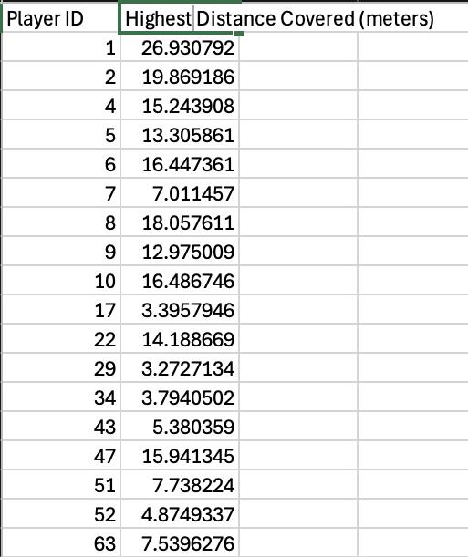
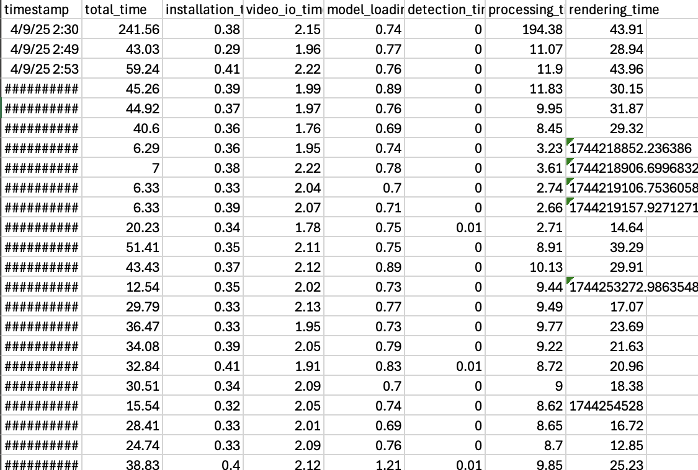

# Rugby Player Tracking System (v1.2)

Advanced player tracking system for rugby videos with team assignment, speed tracking, and comprehensive statistics - optimized for MacBook performance.

 


✨ What's New in v1.2

    🚀 Major optimization improvements - Up to 3x faster processing on MacBooks
    📊 Comprehensive player statistics - Track all players simultaneously
    ⏱️ Performance metrics - Model execution speed logged for analysis
    💾 Enhanced data export - Detailed CSV exports for all tracked metrics

Player statistics and program performance metrics

 

Features

    🏃‍♂️ Track individual players with unique IDs

    📏 Calculate real-world distances in meters with improved accuracy

    📊 Monitor total distance covered by each player

    📈 Performance logging to monitor model efficiency

    📱 Optimized specifically for Apple Silicon MacBooks (M1/M2/M3)

    📁 All player statistics automatically saved to CSV files

Installation
```bash
# Clone the repository
git clone https://github.com/raynsj/rugby-analysis-yolov8.git
cd rugby-analysis-yolov8
```

# Install dependencies for MacOS

```bash
pip install -r requirements_mac.txt
```

# Run
```python
# Run conversion_script.py ONCE first
python conversion_script.py

# Run main program
python main.py
```

# MacBook Compatibility

This version is specifically optimized for:

    MacBook Pro/Air with Apple Silicon (M1/M2/M3)

    macOS Monterey or later

    Python 3.9+

Performance benchmarks on MacBook M3 Air:

    7-second video: ~30 seconds processing (vs. 3+ minutes in v1.1)

# Usage

Place your rugby video in the input_videos/ folder

Track All Players

The new version automatically tracks all players by default and saves total distance statistics:

# Output

The system now generates two CSV files automatically:

    player_statistics.csv: Distance data for all players

    performance_metrics.csv: Processing speed and model performance data

# How it works

This system uses optimized computer vision and machine learning to track rugby players:

    Object Detection: Uses YOLO with CoreML optimizations on MacBooks for faster detection

    Player Tracking: Maintains player identities across frames with improved algorithm

    Motion Analysis: Calculates player movement between frames with optimized optical flow calculations

    Distance Calculation: Measures total distance covered by each player in real-world units

    Performance Tracking: Monitors model execution time and resource usage


# Performance Improvements

v1.2 introduces significant optimizations for MacBook users:

    Core ML integration for Apple Silicon acceleration
    
    Frame Skipping	
    
    Sparse Optical Flow
    
    Resolution Scaling

    Reduced precision calculations where appropriate

    Background export of statistics to minimize processing delays


# Disclaimers

While v1.2 brings significant performance improvements, this project remains under active development. This passion project continues to evolve with regular updates focusing on both performance and accuracy.

This is by no means a final product. This is currently a passion project initiated and done completely by myself and I will continue to hone my skills and push updates constantly.

Stay tuned for more!

